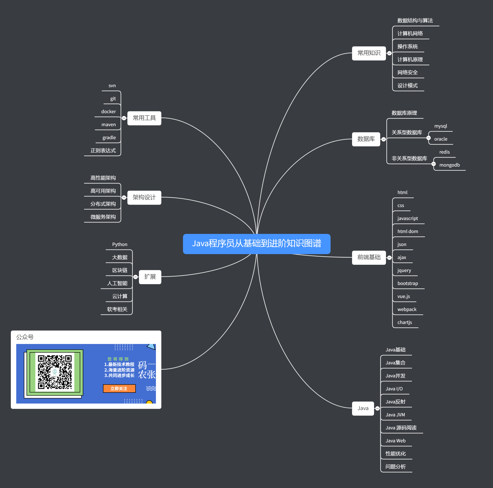

  
  
  
  

　　**项目初期，大部分还未进行整理，该仓库会持续更新，望star一下或关注公众号，第一时间了解更新**

　　因文人技术水平及文本有限，该仓库主要是收集Java各种技术的教程、资源和经典文章，向读者进行经典教程、书籍、文章、视频和项目等方面推荐。另提供给Java程序员从基础到进阶的学习路径，帮助Java程序员成长。

　　推荐使用[http://coderzcr.gitee.io/senior-java](http://coderzcr.gitee.io/senior-java)在线阅读。gitee是国内网站，访问速度快。

# Java程序员从基础到进阶知识图谱

　　本图谱参考[fullstack-tutorial](https://github.com/frank-lam/fullstack-tutorial/blob/master/notes/SkillTree/backend-skill.md)、[toBeTopJavaer](https://github.com/hollischuang/toBeTopJavaer/blob/master/mind-map.md)、[advanced-java](https://github.com/doocs/advanced-java)三位大神所作仓库，结合自己的理解完成。

## 💻 常用知识
- [数据结构与算法]()
- [计算机网络]()
- [操作系统]()
- [计算机原理]()
- [网络安全]()
- [设计模式]()

## 💾 数据库
- [数据库原理]()
- [关系型数据库]()
- [非关系型数据库]()

## 🎦 前端基础

- [html](article/front/html.md)
- [css](article/front/css.md)
- [javascript](article/front/javascript.md)
- [html dom](article/front/htmlDom.md)
- [json](article/front/json.md)
- [ajax](article/front/ajax.md)
- [jquery](article/front/jquery.md)
- [bootstrap](article/front/bootstrap.md)
- [vue.js](article/front/vue.js.md)
- [webpack](article/front/webpack.md)
- [chartjs](article/front/chartjs.md)

## 🎨 Java
- [Java基础]()
- [Java集合]()
- [Java并发]()
- [Java I/O]()
- [Java反射]()
- [Java JVM]()
- [Java 源码阅读]()
- [Java Web]()
- [性能优化]()
- [问题分析]()

## 💼 常用工具
- [svn]()
- [git]()
- [docker]()
- [maven]()
- [gradle]()
- [正则表达式]()

## 📖 架构设计
- [高性能架构]()
- [高可用架构]()
- [分布式架构]()
- [微服务架构]()

## ☁️ 扩展
- [Python]()
- [大数据]()
- [区块链]()
- [人工智能]()
- [云计算]()
- [软考相关]()

## 📙 技术书签
- [大神博客](article/bookmark/大神博客.md)
- [技术教程](article/bookmark/技术教程.md)

## 说明

### 介绍
　　**项目初期，大部分还未进行整理，该仓库会持续更新，望star一下或关注公众号，第一时间了解更新**
　　因文人技术水平及文本有限，该仓库主要是收集Java各种技术的教程、资源和经典文章，向读者进行经典教程、书籍、文章、视频和项目等方面推荐。另提供给Java程序员从基础到进阶的学习路径，帮助Java程序员成长。

### 为什么

　　为什么整理Java程序员从基础到进阶的学习路径的相关资源，是因为网上教程众多，不完整且零散，而且质量参差不齐，使读者更为困惑。故开设该仓库，向读者推荐教程、资源等，指点迷津，共同成长。

### 联系我
　　因涉及技术众多，且本人技术有限，不免有纰漏之处。若**有错误或者有推荐的经典教程、书籍、文章、视频和项目**，请联系我！以下个人微信号，添加我的微信备注“Senior-Java”。

### 公众号

