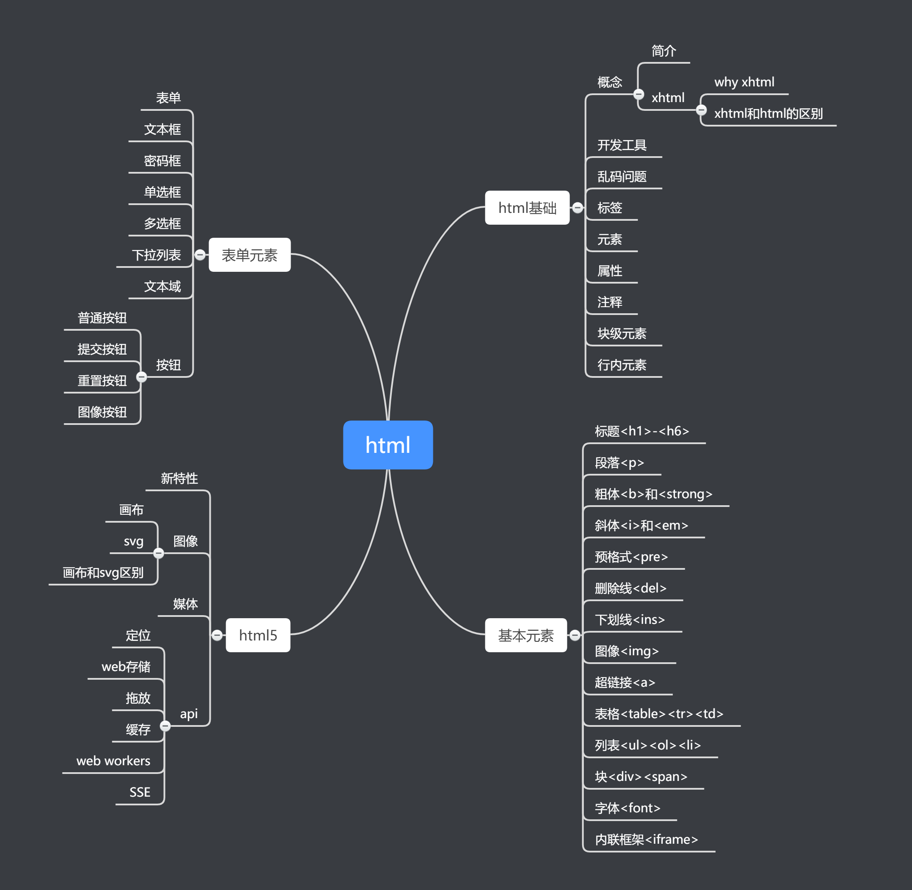

## 知识图谱

## 推荐教程
- [how2j html教程，通俗易懂，适合入门](http://how2j.cn/k/html/html-tutorial/175.html)
- [w3school html教程，知识点全面，包含html、xhtml、html5](http://www.w3school.com.cn/html/index.asp)
- [FreeCodeCamp，专门为零基础准备的学习路径，和游戏类似，采用闯关模式，娱乐中学习了知识](freecodecamp.cn/)

## 作者原创

- [html基础](article/front/html/html基础.md)

## 推荐书籍

- Head First HTML与CSS（第2版）。最好的入门书。看两遍就对HTML和CSS有个大概印象了。

## 推荐文章

- [w3school备查手册，适合随时查询知识点](http://www.w3school.com.cn/tags/html_ref_byfunc.asp)

